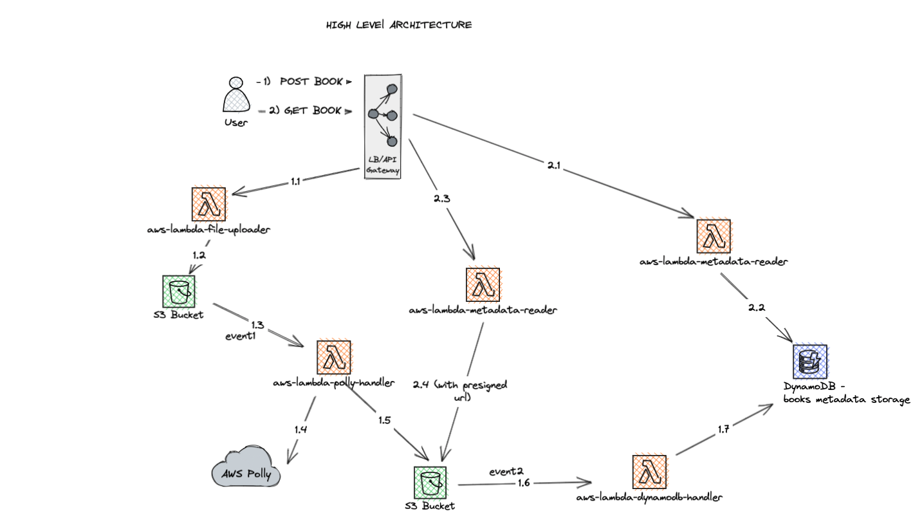

# book-audiofy-cloud-native

This repository contains PoC which is illustrating the cloud-native way of audiofying text books. 
There are 3 main functionalities here: 
- add new book to the system;
- observe existing books;
- download book with audio.

## AWS stack abilities which are covered inside this PoC:
- AWS API Gateway: GET, POST (with multipart body) queries;
- AWS S3: reading-writing data via the AWS SDK, generating presigned urls, managing versions for the objects;
- AWS DynamoDB: reading-writing metadata for the S3 objects;
- AWS Polly: text-2-speech;
- AWS Lambda: simple custom functionality for interaction with AWS APIs;
- AWS SQS: publisher-subscriber pattern;
- AWS CloudFront: using CDN for S3 audio files (in progress);
- AWS CloudFormation: infrastructure provisioning.

## Language
- java 1.8
